# euDVWA - Laboratorio de Vulnerabilidades Web (Node.js & Docker)

Este proyecto es un entorno de pruebas controlado para aprender sobre las vulnerabilidades más comunes en aplicaciones web (OWASP Top 10). 
Incluye versiones vulnerables y seguras para cada caso.

## Instrucciones de Instalacion y Ejecucion 

Puedes ejecutar esta laboratorio de dos formas. Se recomienda la opcion A (Docker) por su facilidad de despliegue y seguridad 

### Opcion A : Ejecucion con Docker 

Esta opcion aisla el entorno en un contenedor para evitar conflictos con el sistema local

**Requisitos previos:**
* Tener instalado [Docker Desktop](https://www.docker.com/products/docker-desktop/) y que este ejecutando 

**Pasos:**
1. Abre una terminal en la carpeta raiz del proyecto `euDVWA`.
2. Ejecuta el comando de construccion y arranque : docker compose up --build
3. Esperar a que la terminal muestre este mensaje : Servidor euVWA corriendo en http://localhost:3000.
4. Abre tu navegador en : http://localhost:3000

### Opcion B : Ejecucion en Local (Node.js)

**Requisitos previos:**
* Tener instalado Node.js (Version 18 o superior)
* Tener instalado npm (Viene incluido con Node.js) 

**Pasos**
1. Abre una terminal en la carpeta raiz del proyecto `euDVWA`.
2. Instala las dependencias necesarias ejecutando el comando: npm install 
3. Inicia el servidor ejecutando el comando : npm start
4. Abre tu navegador en : http://localhost:3000

## Como detener el laboratorio 
(A) Docker : Presiona Control + C en la terminal o ejecuta el comando : docker compose down 
(B) Local : Presiona Control + C en la terminal donde se esta ejecutando el proceso 

## Tabla comparativa de las Vulnerabilidades Implementadas 

| Vulnerabilidad | Riesgo (Versión Vulnerable) | Corrección Técnica (Versión Segura) |
| :--- | :--- | :--- |
| **1. XSS Reflejado** | Los datos de una búsqueda se muestran en pantalla sin filtrar, permitiendo ejecutar scripts mediante la URL. | Uso de **Contextual Output Encoding** transformando caracteres peligrosos en texto innofensivo |
| **2. XSS Almacenado** | Los scripts maliciosos se guardan en la base de datos y se ejecutan para cada usuario que visite la página. | **Sanitización** de entrada y limpieza de HTML como DOMPurify para eliminar etiquetas peligrosas. |
| **3. Command Injection** |Ejecución de comandos del sistema operativo concatenando entradas del usuario, pudiendo comprometer el servidor |Reemplazo de funciones tipo exec() por **APIs de Node.js**que no interpretan símbolos de consola (como &&,;,|) o validación mediante Regex estricto. |
| **4. SQL Injection** |Manipulación de consultas a la base de datos mediante caracteres especiales, permitiendo el bypass de login o robo de datos. | Implementación de **Consultas Parametrizadas** que neutralizan cualquier intento de inyección de código. |
| **5. File Upload** | Permite subir archivos con extensiones peligrosas (.js, .sh, .php) que el servidor podría ejecutar accidentalmente.| Validación por **MIME-type (contenido)**, renombrado de archivos a nombres aleatorios y almacenamiento en directorios sin permisos de ejecución.. |
| **6. Broken Auth** | Fallos en la gestión de sesiones o contraseñas débiles, permitiendo ataques de fuerza bruta o robo de tokens JWT. |Uso de **JWT con firma robusta**, almacenamiento en cookies **HttpOnly** y políticas de contraseñas seguras con **bcrypt**. |
| **7. Misconfiguration** | Exposición de cabeceras de servidor, mensajes de error detallados o uso de configuraciones por defecto inseguras. | Endurecimiento mediante cabeceras **Helmet (HSTS, CSP)** y desactivación de información del sistema en los mensajes de error. |
| **8. Access Control** |Permite acceder a recursos de otros usuarios cambiando simplemente un ID en la URL (Insecure Direct Object Reference). | Implementación de **Verificación de propiedad** a nivel de base de datos; el sistema comprueba si el recurso pertenece realmente al usuario autenticado.

## Pruebas de vulnerabilidad 
### 1. XSS Reflejado 
**Payload:** ``
(En el cuadro de búsqueda o en el parámetro ?name= de la URL)

**Resultado:** El navegador ejecuta el script malicioso inmediatamente al procesar la entrada del usuario a través de la URL o el formulario de saludo.

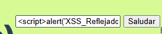

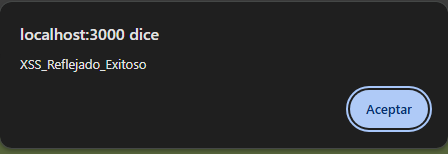

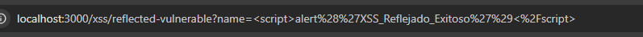

### 2. XSS Almacenado 
**Payload:** ``
(En el cuadro de comentarios)

**Resultado:** El script se guarda permanentemente en la base de datos del servidor. Cada vez que cualquier usuario visita la sección de comentarios, el script se ejecuta automáticamente.

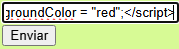

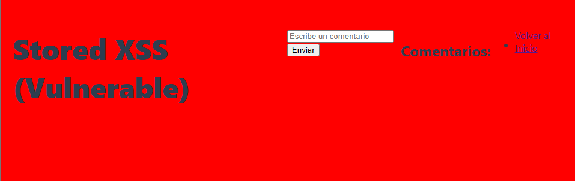

### 3. Command Injection 
**Payload:** `127.0.0.1 && whoami`
(En el input que pide una IP para hacer "Ping")

**Resultado:** El servidor concatena la entrada del usuario con un comando de sistema (`ping`), permitiendo la ejecución de comandos adicionales no autorizados.

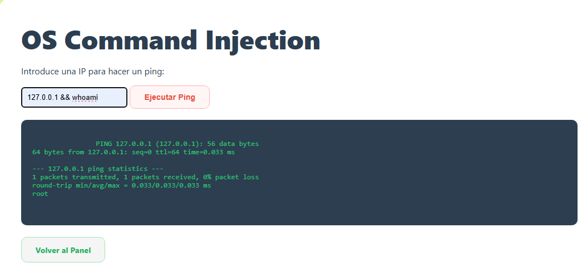

### 4. SQL Injection
**Payload:** `1 UNION SELECT id, username, password FROM users`
(En el formulario de Login)

**Resultado:** La falta de sanitización en el parámetro ID permite concatenar instrucciones SQL. Mediante un ataque de `UNION`, es posible extraer columnas de la tabla de usuarios que no deberían ser visibles.

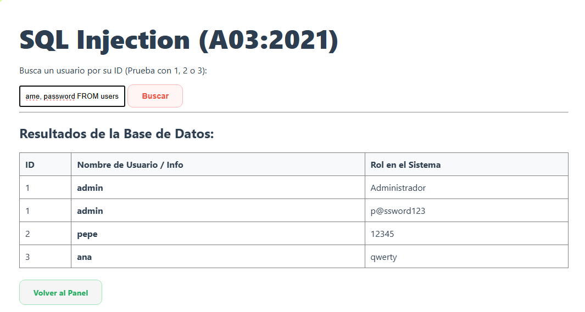

### 5. Unrestricted File Upload
**Payload:** Subir un archivo malicioso, en este caso `ataque.html`

**Resultado:** Ejecución de código HTML/JS arbitrario desde el directorio de subidas.

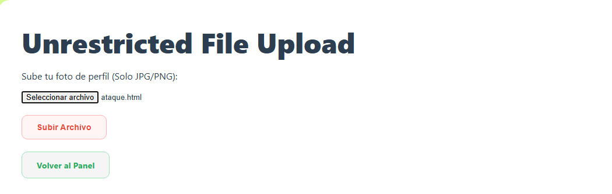
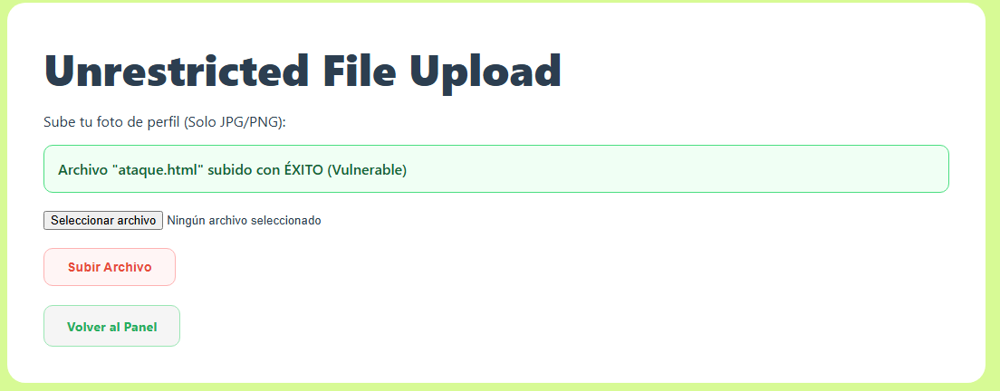
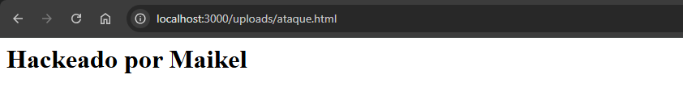

### 6. Broken Authentication de JWT 

1. **Generación del Token:** Al realizar el login exitoso, el servidor genera un JWT y lo almacena en una cookie llamada `token`. Como se observa, la cookie tiene la bandera `HttpOnly` desactivada en la versión vulnerable, lo que la hace susceptible a robos mediante XSS.
   
   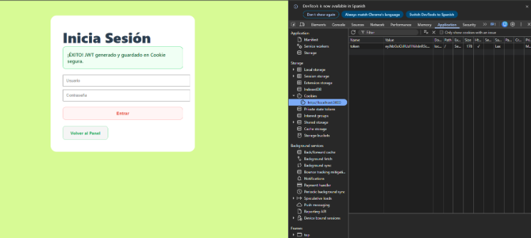

2. **Inspección del Token:** Utilizando la pestaña *Application* del navegador, podemos extraer el valor codificado del token.
   
   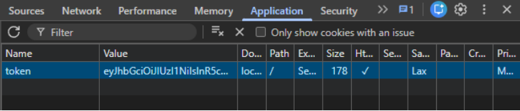

3. **Decodificación y Análisis:** Al introducir el token en una herramienta de análisis como **CyberChef** (usando la operación *JWT Decode*), se revela la carga útil (Payload) en texto plano. 
   * **Payload revelado:** Se observa el campo `"role": "admin"`.
   * **Riesgo:** Un atacante podría intentar modificar este campo y reempaquetar el token. Si el servidor no verifica la firma con un secreto robusto, aceptaría la identidad falsificada.

    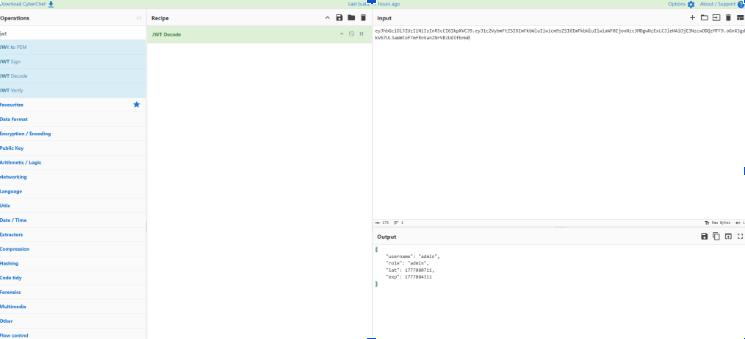
    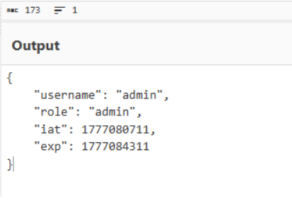

### 7. Security Missconfiguration 
**Prueba:** Al inspeccionar las cabeceras de respuesta, el servidor expone la tecnología exacta de ejecución.
* **Información revelada:** `X-Powered-By: Express`
* **Riesgo:** Permite a un atacante identificar la versión del software y buscar vulnerabilidades conocidas (CVEs) para ese entorno específico.

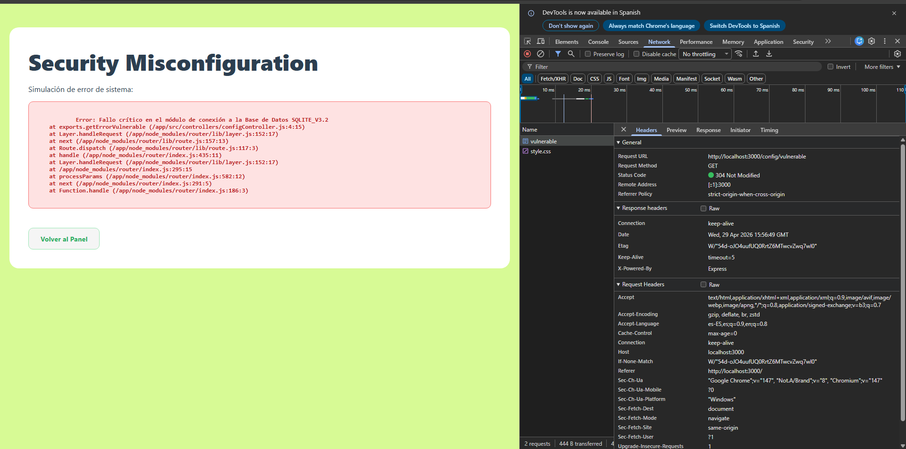
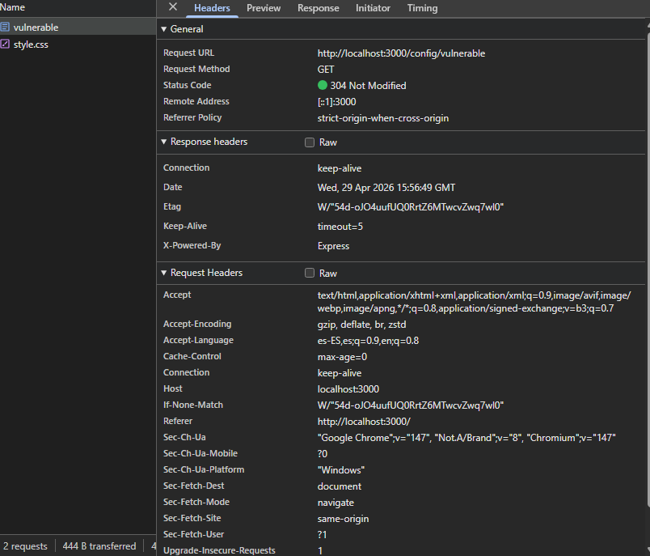

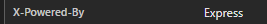

### 8. Broken Access Control 
**Prueba:**
1. Se accede al perfil propio con el parámetro `?id=2`.
2. Se modifica manualmente el parámetro en la URL a `?id=1`.
3. El servidor devuelve la información privada de un usuario distinto sin solicitar una sesión válida para dicho recurso.

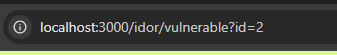

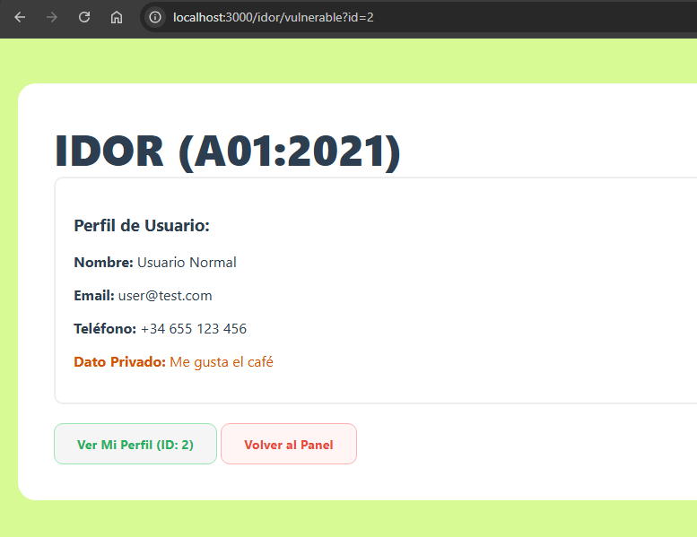

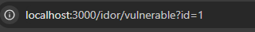

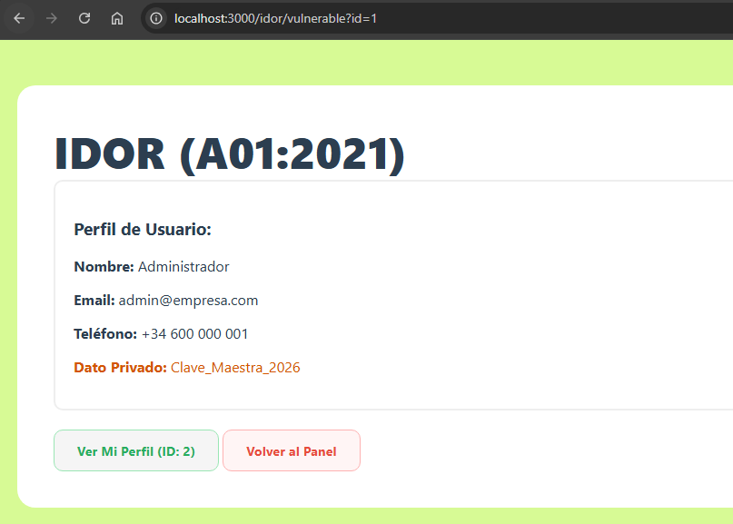